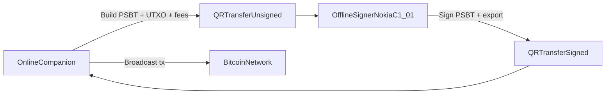

# Java ME Bitcoin Wallet Plan

## Goal

Define a realistic, security-first blueprint for a **strict air-gapped** Bitcoin wallet ecosystem where Nokia C1-01 acts as offline signer, including:

- Product PRD
- Technical architecture/spec
- Claude Code prompt templates for implementation scaffolding
- Conventional Java ME starter/boilerplate guidance

## Constraints to Encode

- Target device: Nokia C1-01 (Series 40 class, Java ME constraints)
- Security target: production-grade mainnet posture
- Air-gap requirement: no direct chain access from signer device
- Photo entropy policy: optional extra entropy, always mixed with secure RNG (never sole source)

## Planned Deliverables

- PRD draft at [docs/prd-airgapped-bitcoin-javame.md](docs/prd-airgapped-bitcoin-javame.md)
- Technical spec at [docs/spec-airgapped-architecture.md](docs/spec-airgapped-architecture.md)
- Security/crypto profile at [docs/security-crypto-profile.md](docs/security-crypto-profile.md)
- Prompt pack at [docs/prompts/claude-code-scaffold-prompts.md](docs/prompts/claude-code-scaffold-prompts.md)
- Scaffold blueprint at [docs/scaffold-repo-layout.md](docs/scaffold-repo-layout.md)
- Boilerplate survey at [docs/boilerplate-options-javame.md](docs/boilerplate-options-javame.md)

## Architecture Direction (for spec)

- Offline signer responsibilities:
  - Seed generation/import, encrypted key storage, address derivation, PSBT signing, QR I/O
- Online companion responsibilities:
  - UTXO sync, fee estimation, tx construction, broadcast, balance/history indexing
- Interop standards baseline:
  - PSBT (`BIP174`), HD derivation (`BIP32/BIP44/BIP84`), addresses (`BIP173`), mnemonic compatibility (`BIP39` with caveats), descriptors for future extensibility
  - QR transport profile: start with compact single-frame payloads; specify multi-frame strategy for larger payloads

## Conventional Java ME Scaffold Strategy

- Recommend legacy-compatible MIDlet scaffold (Ant + JAD/JAR packaging) for predictable Series 40 deployment
- Evaluate UI stack options in survey:
  - LCDUI-only baseline (lowest risk)
  - LWUIT/J2ME Polish only if footprint/perf acceptable
- Define module boundaries to keep future multi-chain support clean:
  - `core-crypto`, `wallet-domain`, `transport-qr`, `storage-secure`, `ui-midlet`, `companion-protocol`

## What I will include in the PRD/spec content

- Explicit threat model and non-goals (phishing, compromised companion, side-channel limits)
- Recovery and backup UX requirements
- Multi-wallet/account model and key-path namespace design
- Transaction flow UX for air-gapped signing
- Camera/QR fallback behavior on constrained hardware
- Test strategy (known vectors, deterministic signing tests, device matrix, fail-safe tests)
- Release gates and security checklist before handling real funds

## Boilerplate/Standards Findings to capture

- There is no modern, widely adopted “Bitcoin-on-Java-ME production boilerplate”
- Practical baseline is classic Java ME MIDlet build conventions plus custom crypto/interop layers
- Air-gapped wallet interoperability should be standardized around PSBT and a deterministic QR encoding profile

## Execution Order

1. Draft PRD with product scope, personas, workflows, and acceptance criteria.
2. Draft technical spec with components, data model, key management, and API/protocol contracts.
3. Draft crypto/security profile with standards and hardening requirements.
4. Draft Claude prompt pack to generate scaffold code incrementally and safely.
5. Draft repository scaffold map and boilerplate comparison/recommendation.
6. Add a milestone roadmap (M0 emulator, M1 real device signer, M2 companion integration, M3 security hardening).
